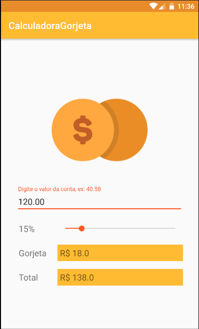

# CalculadoraGorjeta

* Dado o preço de uma conta, o usuário pode selecionar uma porcentagem e assim ser feito o cáculo de uma gorjeta, a partir dessa porcentagem, e o valor total da conta com a adicação da gorjeta.

